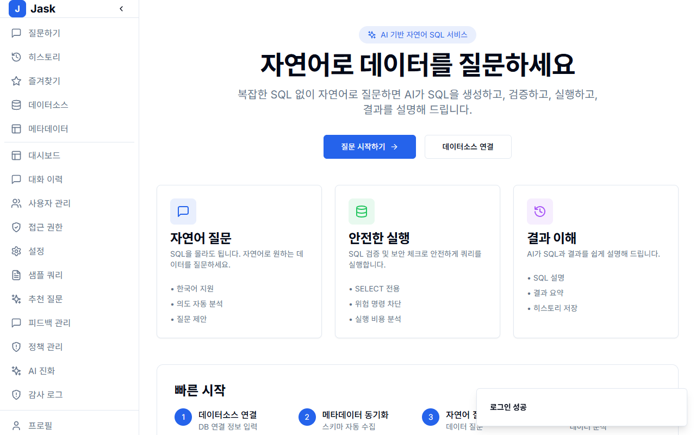
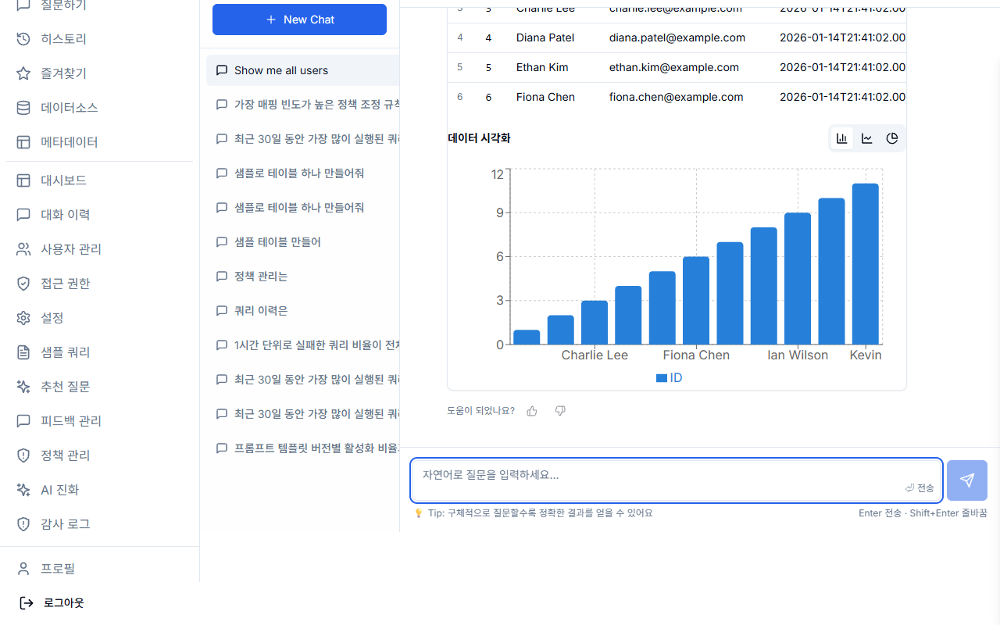
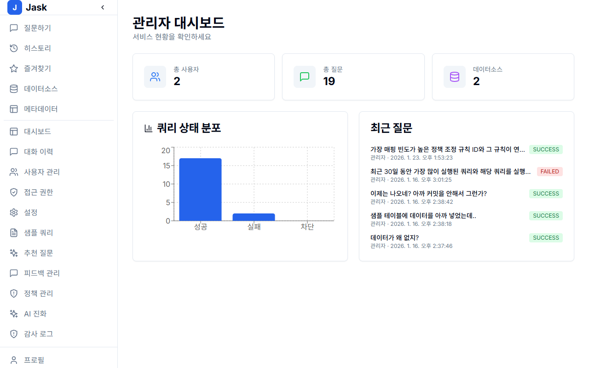

# Jask - 자연어 기반 SQL 서비스

**Jask**는 복잡한 SQL 문법 없이 자연어로 데이터베이스와 대화할 수 있는 엔터프라이즈 AI 플랫폼입니다.
사용자의 질문을 이해하여 최적의 SQL을 생성하고, 안전하게 실행하며, 그 결과를 시각적으로 설명해줍니다.

## 📚 Documentation

상세 가이드는 `docs` 폴더를 참고하세요.

- **[📖 사용자 가이드 (User Guide)](docs/USER_GUIDE.md)**
  - 💡 자연어로 질문하는 법
  - 📊 차트 및 데이터 분석 활용
  - ⭐️ 즐겨찾기 및 히스토리 관리
- **[🛡️ 관리자 가이드 (Admin Guide)](docs/ADMIN_GUIDE.md)**
  - 👥 사용자 및 권한 관리 (RBAC)
  - 🔌 데이터 소스 연결 및 메타데이터 관리
  - 📝 감사 로그 및 시스템 설정

---

## 📸 Key Features & Screenshots

### 1. Natural Language Query (자연어 질의)

사용자가 자연어로 질문하면 AI가 의도를 파악하고 SQL을 생성합니다. 사용자는 생성된 SQL과 실행 결과를 즉시 확인할 수 있습니다.

|             메인 인터페이스             |             질문 결과 및 시각화             |
| :-------------------------------------: | :-----------------------------------------: |
|  |  |
|    _"작년 월별 매출 추이를 보여줘"_     |    자동 생성된 차트와 데이터 테이블 제공    |

### 2. Admin Dashboard & Management (관리자 기능)

시스템 현황을 한눈에 파악하고, 사용자 및 데이터 접근 권한을 세밀하게 제어할 수 있습니다.

|                   관리자 대시보드                   |                 메타데이터 관리                  |
| :-------------------------------------------------: | :----------------------------------------------: |
|  |  |
|         시스템 사용량 및 주요 지표 모니터링         |       테이블/컬럼 설명 및 동의어 사전 관리       |

### 3. Detailed Features

- **🛡️ Secure & Safe**: `SELECT` 문만 실행하도록 제한하며, 파괴적인 쿼리(DROP, DELETE)는 자동으로 차단하거나 관리자 승인을 요구합니다.
- **🧠 Schema Awareness**: 데이터베이스의 스키마와 메타데이터(컬럼 설명, 관계)를 학습하여 정확도 높은 쿼리를 생성합니다.
- **🔍 Query Explainer**: 왜 이런 결과가 나왔는지, 생성된 SQL은 어떤 의미인지 AI가 친절하게 설명합니다.
- **📈 Data Visualization**: 결과 데이터에 적합한 시각화(Bar, Line, Pie Chart)를 자동으로 추천하고 그려줍니다.
- **📝 Audit & Compliance**: 누가 언제 어떤 데이터를 조회했는지 모든 활동이 기록됩니다.

---

## 🚀 Quick Start

### Prerequisites

- Node.js 18+
- Docker & Docker Compose
- (Optional) NVIDIA GPU for Ollama

### 1. Start Development Environment

```bash
# Start PostgreSQL, Redis, Ollama
docker-compose up -d

# Install dependencies
npm install

# Setup database
npm run db:push

# Start development servers
npm run dev
```

### 2. Access

- **Frontend**: http://localhost:3000
- **Backend API**: http://localhost:4000
- **API Docs**: http://localhost:4000/api/docs

## 📁 Project Structure

```
jask/
├── docs/              # User/Admin Guides & Images
├── frontend/          # Next.js 14 App
├── backend/           # NestJS API Server
├── docker-compose.yml # Development Environment
└── package.json       # Monorepo Configuration
```

## ✨ Features

- **NL2SQL**: 자연어 → SQL 변환
- **메타데이터 관리**: DB 스키마 자동 수집 및 설명
- **SQL 검증**: 보안 및 성능 검증
- **결과 시각화**: 테이블, 차트, 요약
- **쿼리 히스토리**: 이전 질문 조회 및 즐겨찾기

## 🔧 Tech Stack

- **Frontend**: Next.js 14, TypeScript, TailwindCSS, shadcn/ui
- **Backend**: NestJS, Prisma, PostgreSQL
- **AI/LLM**: Ollama, vLLM
- **Vector DB**: pgvector

## 📝 License

MIT
