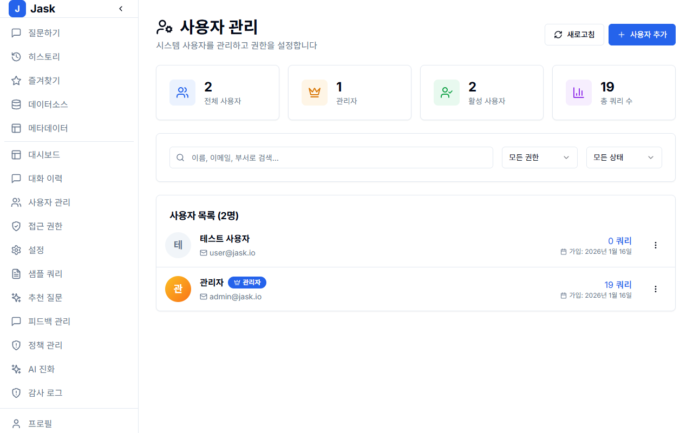
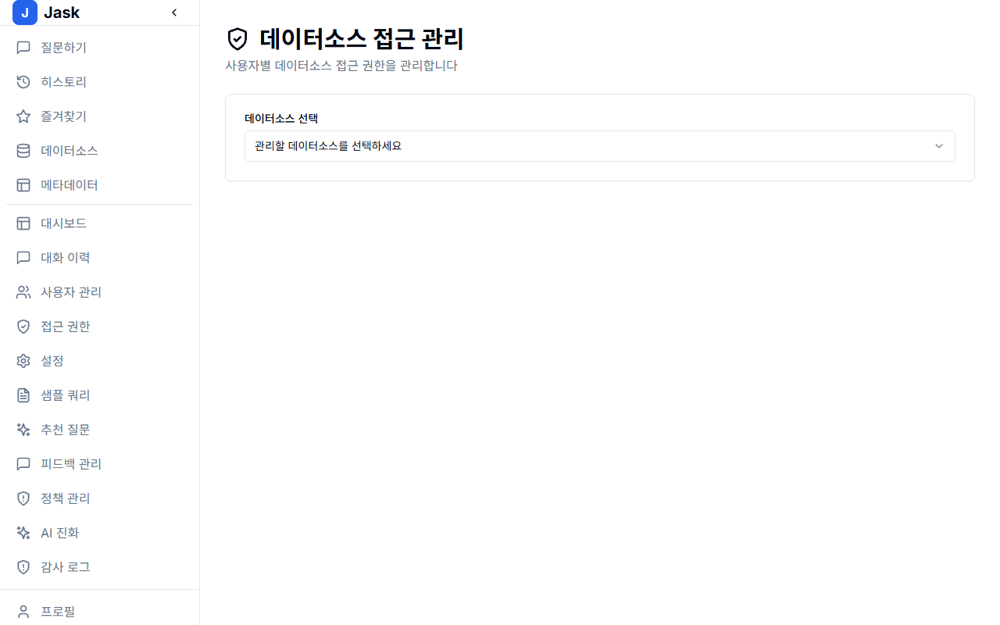
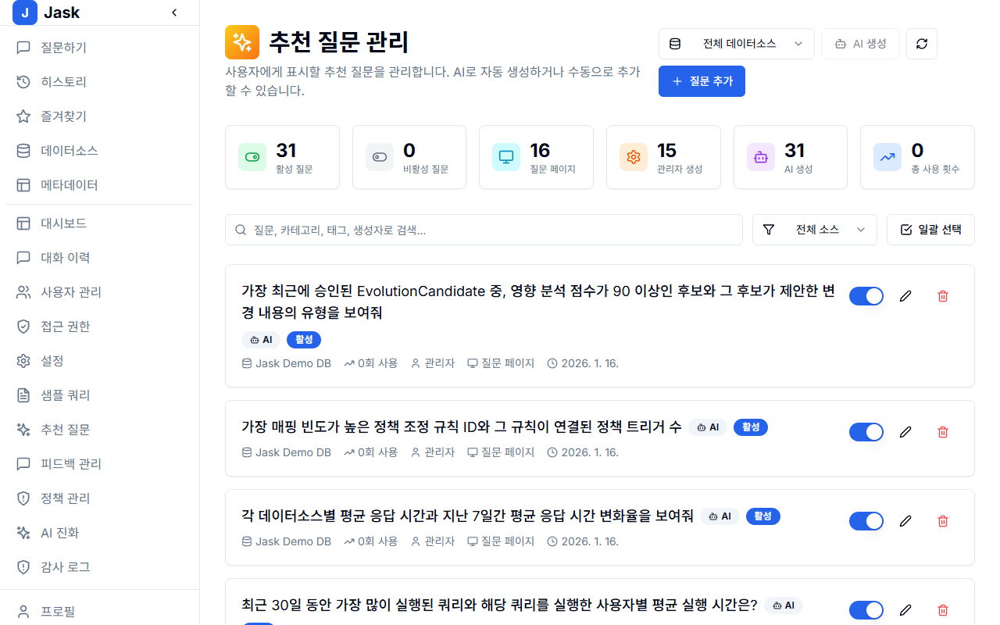
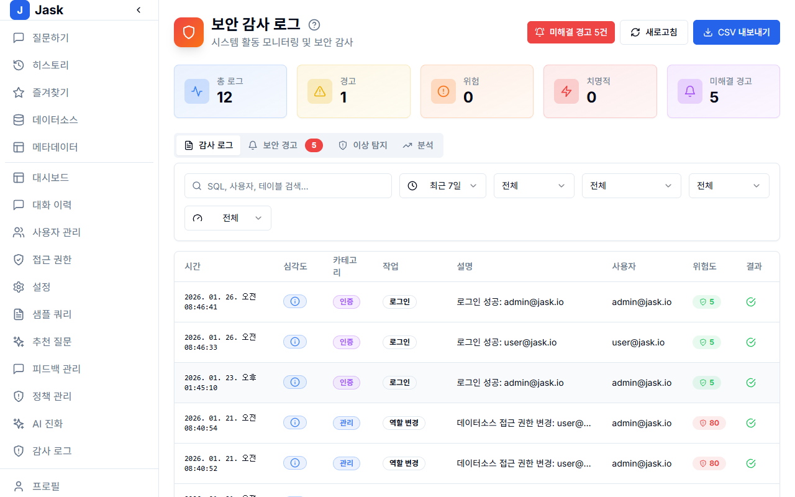
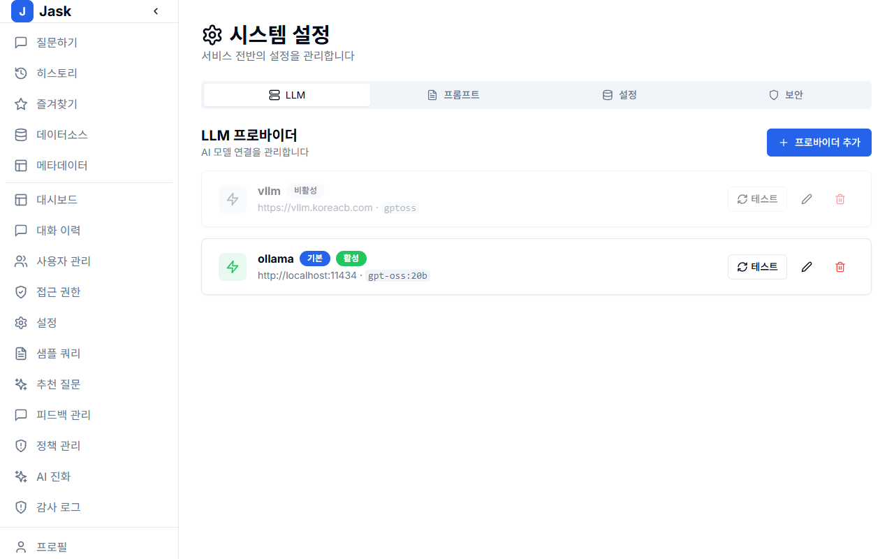

# JASK 관리자 가이드

이 문서는 JASK 플랫폼의 관리자(Administrator)를 위한 가이드입니다.
시스템 설정, 사용자 관리, 데이터 소스 연결 및 보안 설정에 대해 설명합니다.

---

## 목차

1. [관리자 대시보드](#1-관리자-대시보드)
2. [사용자 관리 (Users)](#2-사용자-관리-users)
3. [데이터 소스 관리 (Data Sources)](#3-데이터-소스-관리-data-sources)
4. [메타데이터 및 도메인 지식](#4-메타데이터-및-도메인-지식)
5. [접근 제어 (Access Control)](#5-접근-제어-access-control)
6. [추천 질문 관리](#6-추천-질문-관리)
7. [감사 로그 (Audit Logs)](#7-감사-로그-audit-logs)
8. [시스템 설정](#8-시스템-설정)

---

## 1. 관리자 대시보드

관리자 계정으로 로그인 후 **Admin Console** 또는 대시보드 메뉴로 접근하면 시스템의 전반적인 현황을 볼 수 있습니다.
총 사용자 수, 연결된 데이터 소스 수, 최근 질의 통계 등을 한눈에 확인합니다.

_그림 1: 관리자 대시보드 개요_

---

## 2. 사용자 관리 (Users)

**Users** 메뉴에서는 플랫폼에 접속할 수 있는 사용자를 관리합니다.

- **사용자 추가**: 'Create User' 버튼을 눌러 이메일, 이름, 초기 비밀번호, 역할(Role)을 설정합니다.
- **사용자 수정**: 기존 사용자의 정보를 수정하거나 비밀번호를 초기화할 수 있습니다.
- **사용자 삭제/비활성화**: 퇴사자나 불필요한 계정을 관리합니다.

_그림 2: 사용자 관리 화면_

---

## 3. 데이터 소스 관리 (Data Sources)

JASK가 질의할 원본 데이터베이스를 연결하는 메뉴입니다.

1. **New Data Source** 클릭
2. **DB 타입 선택** (PostgreSQL, MySQL, BigQuery 등)
3. **연결 정보 입력** (Host, Port, User, Password, Database Name)
4. **Test Connection**으로 연결 확인 후 저장

저장 후 초기 메타데이터 스캔이 진행됩니다.

_그림 3: 데이터 소스 추가 및 설정_

---

## 4. 메타데이터 및 도메인 지식

AI의 질의 정확도를 높이기 위해 스키마 정보를 보강할 수 있습니다. **Metadata** 메뉴를 이용합니다.

- **테이블/컬럼 설명**: 각 컬럼이 무엇을 의미하는지 한글/영문 설명을 추가합니다. "biz_dt" -> "영업일자" 등의 매핑이 중요합니다.
- **관계 설정(Relationships)**: 명시적 FK가 없는 경우 논리적인 조인 관계를 설정해줍니다.
- **동의어(Synonyms)**: 사용자가 자주 쓰는 용어를 컬럼과 매핑합니다.

_그림 4: 메타데이터 관리_

---

## 5. 접근 제어 (Access Control)

**Access** 메뉴에서는 누가 어떤 데이터 소스에 접근할 수 있는지 제어합니다.

- **역할 기반 제어(RBAC)**: 특정 Role(부서 등)에 대해 데이터 소스 접근 권한을 부여하거나 차단합니다.
- **사용자별 제어**: 특정 사용자에게만 민감한 DB 접근을 허용할 수 있습니다.

_그림 5: 데이터 소스 접근 권한 설정_

---

## 6. 추천 질문 관리 (Recommended Questions)

사용자들이 자주 묻거나, 관리자가 권장하는 질문 리스트를 관리합니다.
새로운 사용자가 시스템에 들어왔을 때 무엇을 물어봐야 할지 가이드라인을 제공하는 역할을 합니다.

- **질문 추가 및 카테고리화**: 업무별 추천 질문을 등록합니다.
- **자동 수집**: 사용자들이 자주 쿼리한 내용을 바탕으로 추천 목록에 추가할 수 있습니다.

_그림 6: 추천 질문 리스트 관리_

---

## 7. 감사 로그 (Audit Logs)

시스템 보안 및 규정 준수를 위해 모든 중요 활동이 기록됩니다.

- 로그인/로그아웃 이력
- 데이터 소스 변경 이력
- 권한 변경 이력
- 데이터 조회(Query) 이력

검색 및 필터 기능을 통해 특정 시점의 이력을 추적할 수 있습니다.

_그림 7: 감사 로그 확인_

---

## 8. 시스템 설정

**Settings** 메뉴에서는 시스템 전반적인 정책을 설정합니다.

- LLM 설정 (사용할 모델 선택 등)
- 일반 UI 설정

_그림 8: 시스템 설정 화면_
