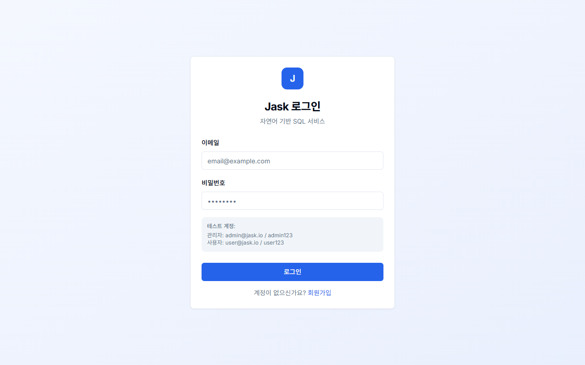
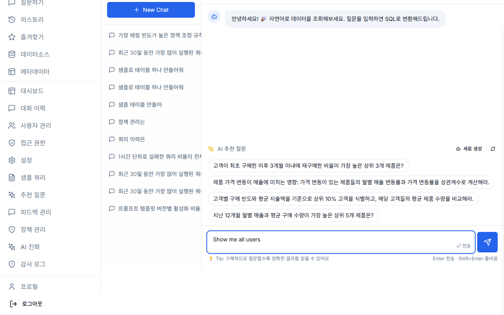
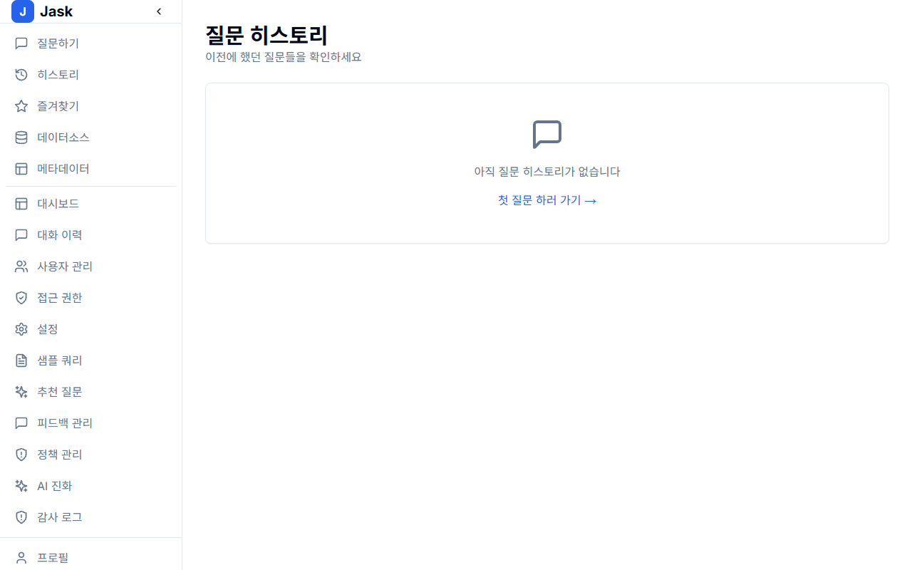
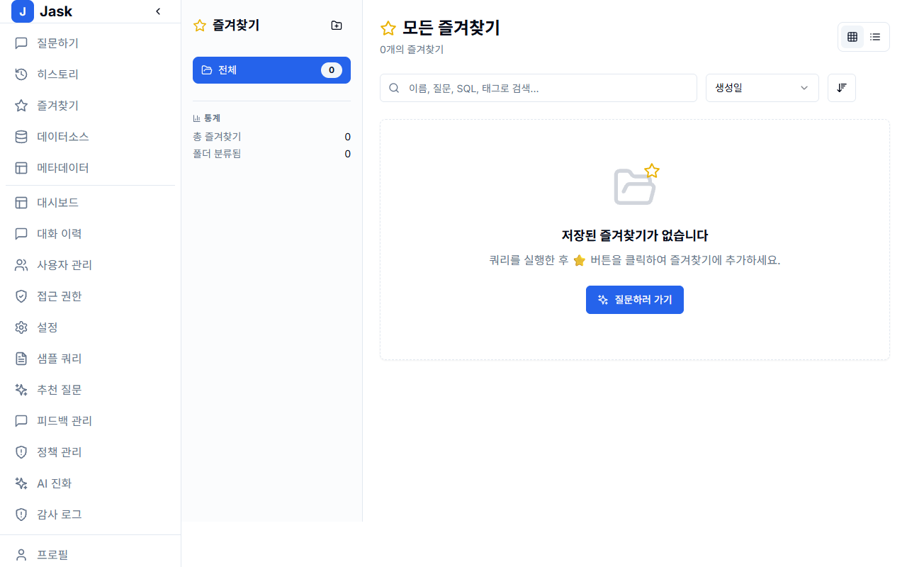
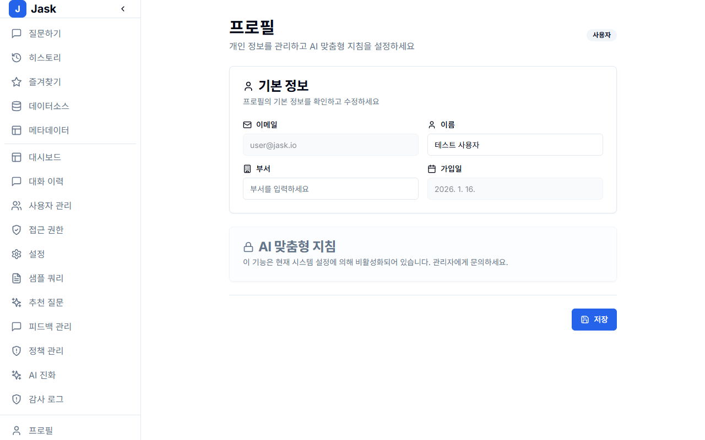

# JASK 사용자 가이드

이 문서는 JASK 플랫폼의 일반 사용자(User)를 위한 상세 가이드입니다.
데이터베이스에 대한 전문 지식 없이도 자연어로 질문하여 데이터를 조회하고 분석하는 방법을 설명합니다.

---

## 목차

1. [시작하기](#1-시작하기)
2. [메인 인터페이스](#2-메인-인터페이스)
3. [질문하기 (Query)](#3-질문하기-query)
4. [결과 확인 및 활용](#4-결과-확인-및-활용)
5. [히스토리 (History)](#5-히스토리-history)
6. [즐겨찾기 (Favorites)](#6-즐겨찾기-favorites)
7. [프로필 설정](#7-프로필-설정)

---

## 1. 시작하기

JASK에 접속하면 로그인 화면이 표시됩니다. 관리자로부터 부여받은 계정 정보를 입력하여 로그인하세요.

_그림 1: JASK 로그인 화면_

---

## 2. 메인 인터페이스

로그인 후 메인 대시보드(또는 Query 화면)로 이동합니다. 왼쪽 사이드바는 주요 메뉴로 구성되어 있으며, 중앙에는 질문을 입력할 수 있는 채팅 인터페이스가 있습니다.

_그림 2: 메인 인터페이스 구성_

- **Query**: 질문을 입력하고 데이터를 조회하는 메인 화면
- **History**: 과거 질문 기록 확인
- **Favorites**: 저장된 자주 쓰는 질문
- **Data Sources** (사용자 권한에 따라 다름): 연결된 데이터 소스 목록

---

## 3. 질문하기 (Query)

JASK의 핵심 기능은 자연어로 데이터를 질문하는 것입니다.

1. **데이터 소스 선택**: 화면 상단(또는 설정)에서 질의할 데이터베이스(Data Source)를 선택합니다.
2. **질문 입력**: 채팅창에 자연어로 궁금한 내용을 입력합니다.
   - 예: "지난달 총 매출은 얼마인가요?"
   - 예: "활성 사용자 수가 가장 많은 상위 5개 도시는?"
3. **전송**: Enter 키를 누르거나 전송 버튼을 클릭합니다.

_그림 3: 자연어 질문 입력_

---

## 4. 결과 확인 및 활용

AI가 사용자의 질문을 분석하여 적절한 SQL 쿼리를 생성하고 수행합니다.

### 4.1 SQL 확인

생성된 SQL을 직접 확인하여 쿼리가 정확한지 검증할 수 있습니다.

_그림 4: AI가 생성한 SQL 쿼리_

### 4.2 데이터 테이블

쿼리 실행 결과가 테이블 형태로 표시됩니다. 결과를 엑셀(CSV) 등으로 다운로드할 수 있는 경우 다운로드 버튼을 이용하세요.

_그림 5: 조회된 데이터 테이블_

---

## 5. 히스토리 (History)

과거에 질문했던 내용을 다시 찾고 싶다면 왼쪽 메뉴의 **History**를 클릭하세요.
날짜별, 키워드별로 이전에 수행한 질문과 결과를 찾아볼 수 있습니다.

_그림 6: 질문 히스토리 목록_

---

## 6. 즐겨찾기 (Favorites)

자주 확인해야 하는 지표나 질문은 결과 화면에서 **즐겨찾기(별표 아이콘)**를 클릭하여 저장할 수 있습니다.
저장된 질문은 **Favorites** 메뉴에서 언제든지 다시 실행할 수 있습니다.

_그림 7: 즐겨찾기 목록_

---

## 7. 프로필 설정

우측 상단 프로필 아이콘을 클릭하여 내 정보를 수정하거나 로그아웃할 수 있습니다.
비밀번호 변경이나 사용자 기본 설정을 이곳에서 관리합니다.

_그림 8: 프로필 설정_
